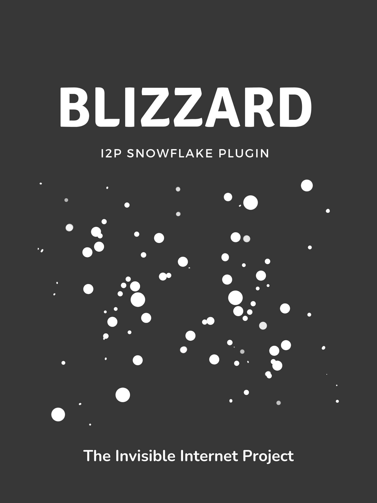

Blizzard: The I2P Snowflake donor Plugin
========================================

This is standalone version of the Tor Project's "Snowflake" proxy, which can be used to produce an I2P Plugin that will donate a Snowflake to Tor Browser Users. The Snowflake uses I2P to manage it's life-cycle. That means when you start and stop your I2P router, you start and stop the snowflake.

Blizzard is Privacy Mutual Aid
------------------------------

We are developing a generation of privacy-aware applications motivated by mutual aid, meant to increase the strengths of other applications in the Privacy and Peer-to-Peer ecosystem.

We learned about instances of attacking Snowflake users by identifying Snowflakes and cutting the users off. This is similar to blocking attempts to I2P where I2P nodes are enumerated and then users are disconnected from those nodes. However, due to I2P's high churn rate, this blocking technique does not appear to have any practical effect on an I2P user's ability to join the network or access information. Blizzard uses I2P's peer diversity and churn to allow access to Tor in blocked areas.

If you can safely use I2P in non-hidden mode, you're probably able to safely donate a Snowflake long-term.

What Does Hidden Mode Mean for the I2P Network?
-----------------------------------------------

When an I2P router is placed in hidden mode, its connection and interaction with the network change in three main ways:

 1. It will no longer publish a routerInfo to the NetDB.
 2. It will no longer accept participating tunnels.
 3. It will reject direct connections to routers in the same country that it is in.

These defences make these routers more difficult to enumerate reliably, and prevent them from potentially being in violation of restrictions on routing traffic for others.

The Invisible Internet Project ( I2P Java) takes information from civil and digital rights organizations in order to make decisions that offer protections for its users. In this case, the ongoing research provided by Freedom House has been referenced. General guidance is to include countries with a Civil Liberties (CL) score of 16 or less or an Internet Freedom score of 39 or less (not free) on a Strict Countries List and automatically be placed into "Hidden" mode.

To see the countries currently included in this list visit: [The I2P Project Website](https://geti2p.net/en/about/restrictive-countries)

Create A Blizzard:
------------------

### Inside I2P
 
 - [Windows (In-I2P)](http://idk.i2p/blizzard/snowflake-windows.su3)
 - [Linux (In-I2P)](http://idk.i2p/blizzard/snowflake-linux.su3)

### Outside I2P

 - [Windows](https://github.com/eyedeekay/blizzard/releases)
 - [Linux](https://github.com/eyedeekay/blizzard/releases)

#### Interested in helping more?

 - [Get the Snowflake Firefox extension](https://addons.mozilla.org/en-US/firefox/addon/torproject-snowflake/)
 - [Get the Snowflake Chrome extension](https://chrome.google.com/webstore/detail/snowflake/mafpmfcccpbjnhfhjnllmmalhifmlcie)
 - [Use the Snowflake Go library to add a proxy to your application](https://pkg.go.dev/git.torproject.org/pluggable-transports/snowflake.git/v2@v2.0.1/proxy/lib)
 - Embed the snowflake badge on your own site by copy-and-pasting the following iframe:

`<iframe src="https://snowflake.torproject.org/embed.html" width="320" height="240" frameborder="0" scrolling="no"></iframe>`

<iframe src="https://snowflake.torproject.org/embed.html" width="320" height="240" frameborder="0" scrolling="no"></iframe>

